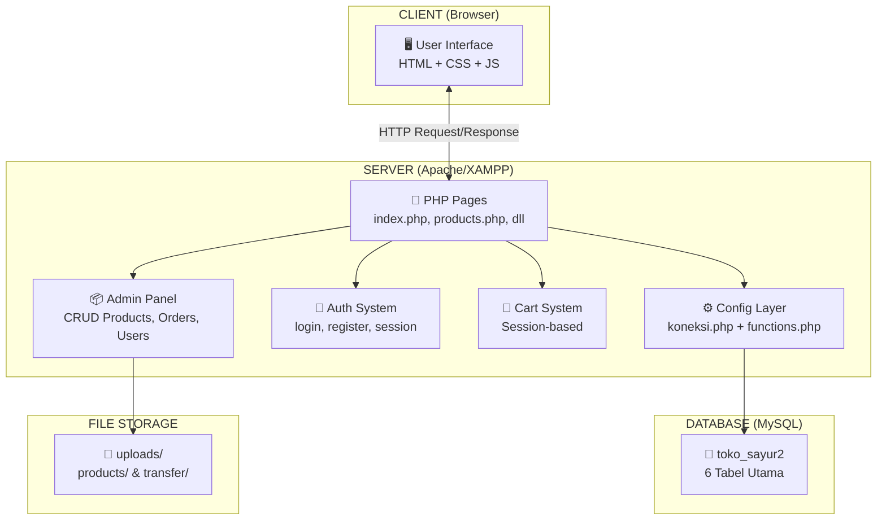
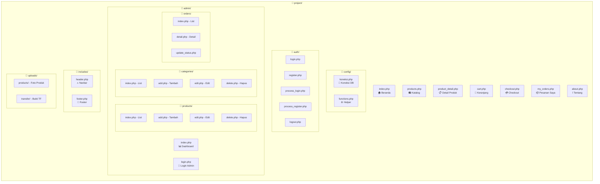
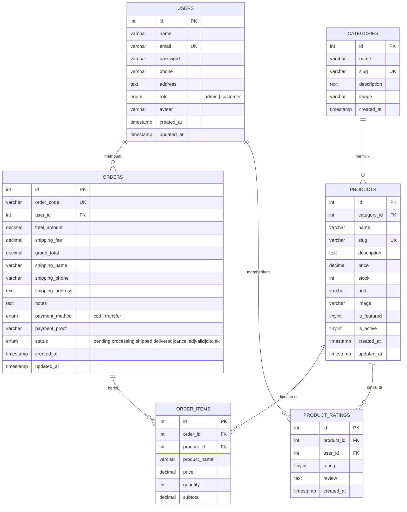
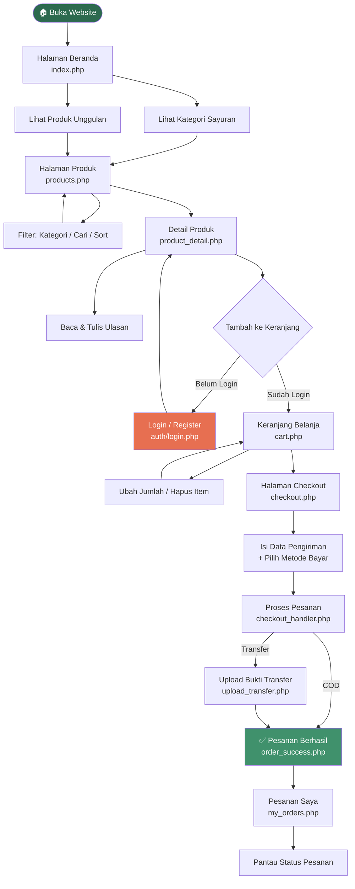
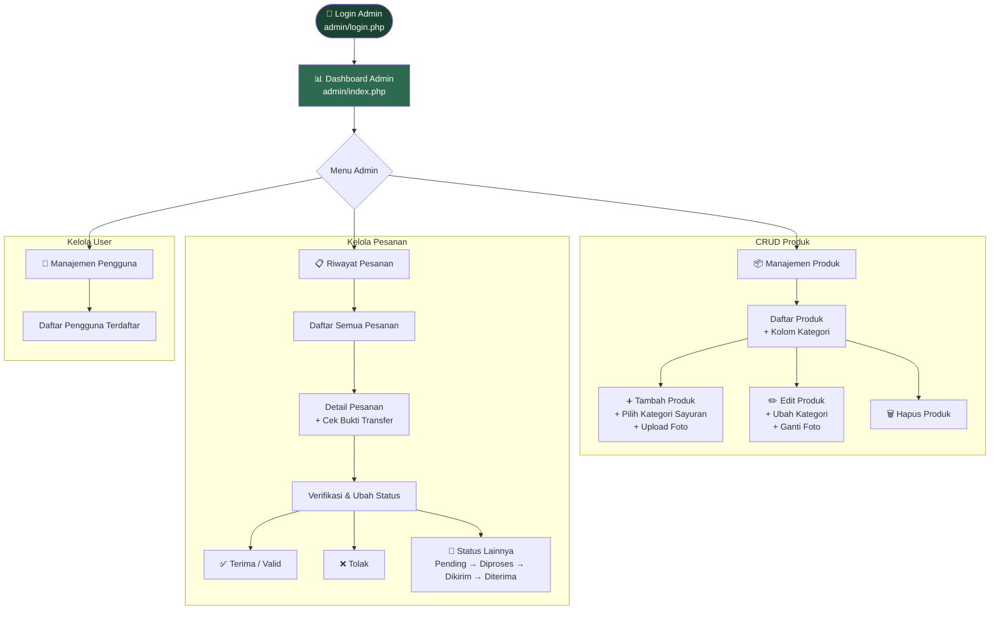
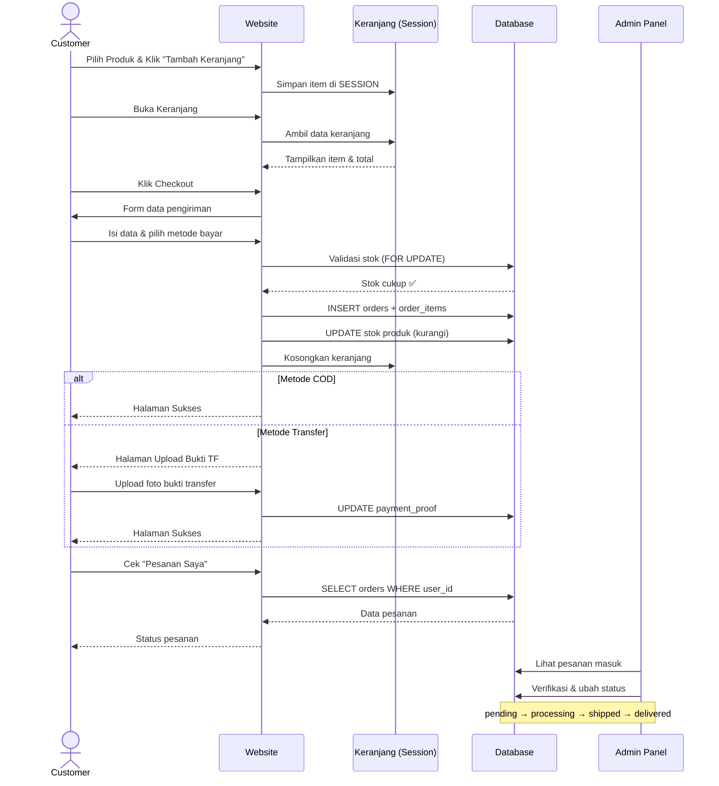
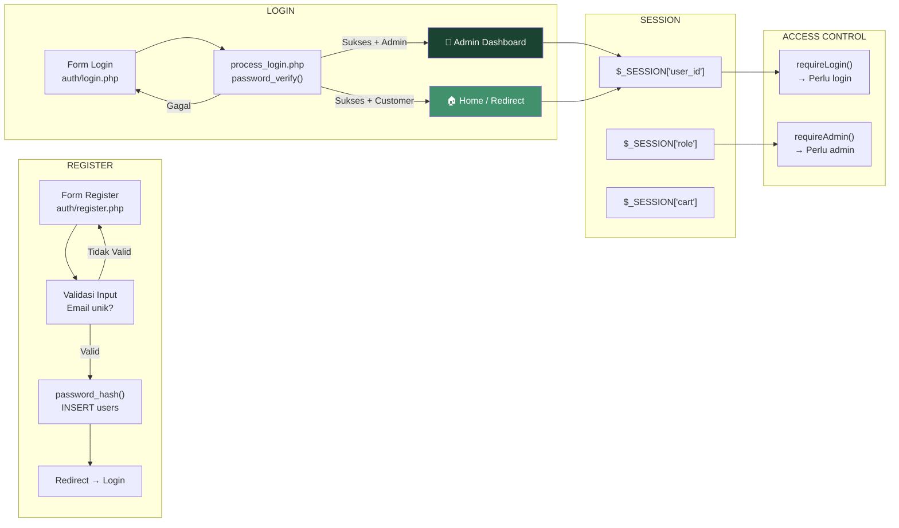
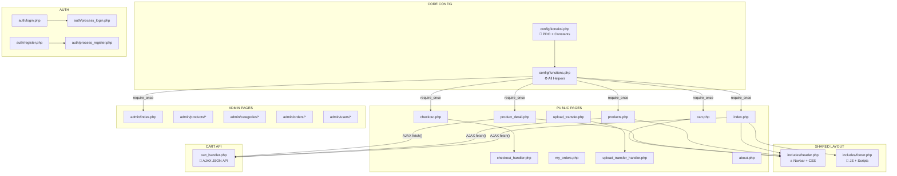
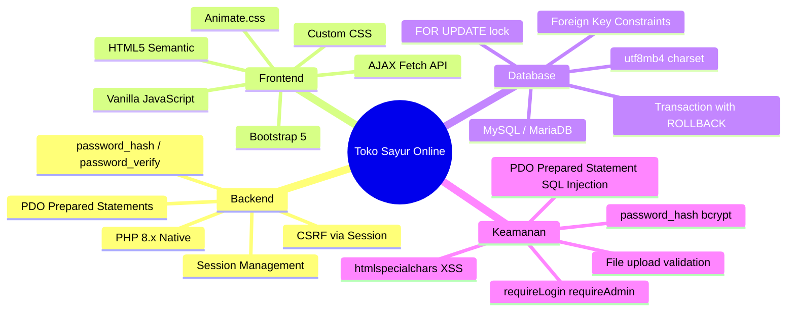

# 🥬 Presentasi Project — Toko Sayur Online

## 1. Gambaran Umum Project

**Toko Sayur Online** adalah aplikasi e-commerce berbasis web untuk penjualan sayuran segar secara online. Dibangun menggunakan arsitektur **PHP Native + MySQL** dengan pola **MVC sederhana**, berjalan di lingkungan **XAMPP** lokal.

| Aspek | Detail |
|-------|--------|
| **Bahasa** | PHP 8.x, JavaScript (Vanilla) |
| **Database** | MySQL (PDO) — `toko_sayur2` |
| **Styling** | Bootstrap 5 + Custom CSS |
| **Server** | Apache via XAMPP |
| **URL** | `http://localhost/project` |

---

## 2. Arsitektur Sistem

---

## 3. Struktur Folder & Tata Letak Project

---

## 4. ERD — Entity Relationship Diagram

### Hubungan Antar Tabel

| Relasi | Tipe | Penjelasan |
|--------|------|------------|
| `users` → `orders` | One-to-Many | 1 user bisa punya banyak pesanan |
| `users` → `product_ratings` | One-to-Many | 1 user bisa memberi banyak rating |
| `categories` → `products` | One-to-Many | 1 kategori memiliki banyak produk |
| `orders` → `order_items` | One-to-Many | 1 pesanan berisi banyak item |
| `products` → `order_items` | One-to-Many | 1 produk bisa ada di banyak order item |
| `products` → `product_ratings` | One-to-Many | 1 produk bisa punya banyak rating |
| `product_ratings` (`product_id`, `user_id`) | Unique | 1 user hanya bisa 1 rating per produk |

---

## 5. Kategori Sayuran

| No | Kategori | Slug | Contoh Produk |
|----|----------|------|---------------|
| 1 | 🥬 Sayuran Hijau | `sayuran-hijau` | Bayam, Kangkung, Sawi, Selada |
| 2 | 🥕 Umbi-Umbian | `umbi-umbian` | Wortel, Kentang, Ubi Jalar |
| 3 | 🍅 Buah Sayur | `buah-sayur` | Tomat, Cabai, Paprika, Terong |
| 4 | 🫘 Kacang-Kacangan | `kacang-kacangan` | Buncis, Kacang Panjang |
| 5 | 🍄 Jamur & Rempah | `jamur-rempah` | Jamur Tiram, Jahe Merah |

---

## 6. Alur Pengguna (Customer Flow)

---

## 7. Alur Admin (Admin Flow)

---

## 8. Alur Pemesanan (Order Flow)

---

## 9. Alur Autentikasi

---

## 10. Hubungan Antar File

---

## 11. Fitur-Fitur Utama

### 🛍️ Sisi Customer (Pembeli)

| No | Fitur | Halaman | Deskripsi |
|----|-------|---------|-----------|
| 1 | Beranda | `index.php` | Hero section, kategori, produk unggulan |
| 2 | Katalog Produk | `products.php` | Filter kategori, search, sorting |
| 3 | Detail Produk | `product_detail.php` | Info lengkap, rating & ulasan, produk terkait |
| 4 | Keranjang | `cart.php` | AJAX add/update/remove, kalkulasi otomatis |
| 5 | Checkout | `checkout.php` | Form pengiriman, pilih metode bayar |
| 6 | Upload Bukti TF | `upload_transfer.php` | Drag & drop upload, preview gambar |
| 7 | Pesanan Saya | `my_orders.php` | Riwayat pesanan + status tracking |
| 8 | Rating & Ulasan | `product_detail.php` | Beri bintang 1-5 + komentar |
| 9 | Register & Login | `auth/*` | Autentikasi dengan `password_hash` |

### 🔐 Sisi Admin

| No | Fitur | Halaman | Deskripsi |
|----|-------|---------|-----------|
| 1 | Dashboard | `admin/index.php` | Statistik total produk, pesanan, pendapatan |
| 2 | CRUD Produk | `admin/products/*` | Tambah/edit/hapus produk + kategori + upload foto |
| 3 | CRUD Kategori | `admin/categories/*` | Kelola kategori sayuran |
| 4 | Kelola Pesanan | `admin/orders/*` | Lihat detail, verifikasi, ubah status |
| 5 | Lihat Pengguna | `admin/users/*` | Daftar pengguna terdaftar |

---

## 12. Teknologi & Keamanan

---

## 13. Akun Demo

| Role | Email | Password |
|------|-------|----------|
| **Admin** | admin@tokosayur.com | password |
| **Customer** | budi@example.com | password |
| **Customer** | siti@example.com | password |

---

## 14. Cara Menjalankan Project

1. Pastikan **XAMPP** sudah terinstall dan **Apache + MySQL** aktif
2. Copy folder `project` ke `C:\xampp\htdocs\`
3. Buka **phpMyAdmin** → Import file `toko_sayur.sql`
4. Akses `http://localhost/project` di browser
5. Login sebagai **Admin** atau **Customer** menggunakan akun demo di atas
